  

CS undergrad at UPES Dehradun ('27). I build market-data systems in C++ and the infrastructure around them.
Candidate Master on Codeforces · GSoC 2026 contributor @ CCExtractor.

## PitchFork — NASDAQ ITCH 5.0 order book engine

Parses a full-day ITCH 5.0 tape at **~8.9M messages/sec (271 MB/s) on a single core**, maintaining live L2 books across all 65,536 locates. Per-message dispatch: p50 153 / p99 458 rdtsc ticks (mean 172.5, warmup discarded).

Every hand-written optimization is benchmarked by ablation — one toggle disabled at a time, identical `-O3 -march=native` build, every variant verified fingerprint-identical against the reference book:

| engine variant | M msg/s |
|---|---:|
| full engine | 8.87 |
| `std::unordered_map` instead of unified order registry | 7.39 |
| sorted-vector book instead of windowed price ladder | 6.34 |
| no `reserve()` / allocator tuning | 8.35 |

The I/O-free core also compiles to a 46 KB WebAssembly module with bit-identical output — which, on a 22.8M-message slice, outruns the native build (17.3 vs 16.4M msg/s). The repo includes an event-driven backtester (order-flow-imbalance study across every symbol on the tape, spread-cost-adjusted P&L), plus the null results — io_uring vs `mmap`, PGO — written up instead of deleted.

**→ [pulk17/nasdaq-itch-orderbook](https://github.com/pulk17/nasdaq-itch-orderbook)**

## Elsewhere

- **[GSoC 2026 @ CCExtractor](https://github.com/CCExtractor/sample-platform)** — building out the REST API for sample-platform, the org's CI and sample-testing infrastructure.
- **[k8n](https://github.com/pulk17/k8n)** — Kubernetes cluster visualizer: live topology via `client-go`, Helm release management. Go · Next.js.
- **[undercover-game](https://github.com/pulk17/undercover-game)** — real-time multiplayer social deduction PWA on zero-cost infra. TypeScript · WebSockets · Redis.

## Contact

[Codeforces — pulk1t](https://codeforces.com/profile/pulk1t) (Candidate Master) · [LeetCode — pulk1tt](https://leetcode.com/u/pulk1tt/) (Knight) · [LinkedIn](https://www.linkedin.com/in/pulk1t/) · [chauhanpulkit1708@gmail.com](mailto:chauhanpulkit1708@gmail.com)
